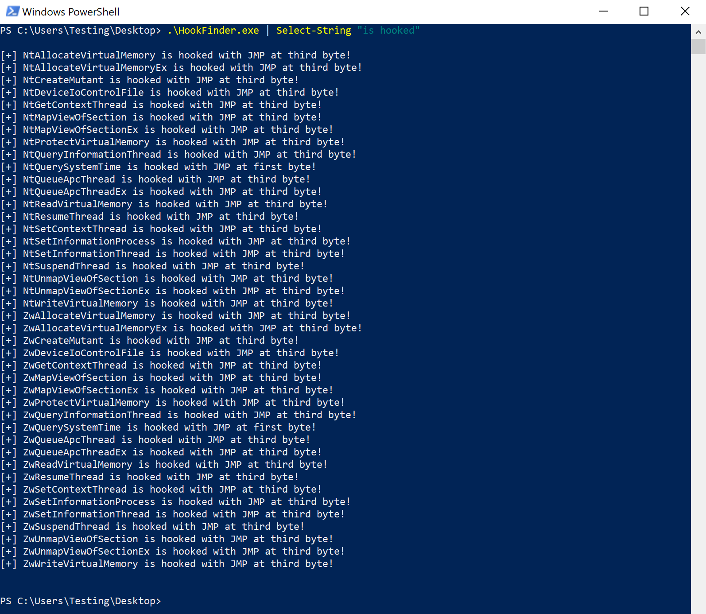

# HookFinder

A simple PoC to locate hooked functions within ntdll.dll to further EDR evasion research.

## About

This PoC uses the same checks that [TartarusGate](https://github.com/trickster0/TartarusGate) uses in order to find hooked system calls. Breaking it down further, the first and third bytes of a function are checked for the bytes matching a JMP instruction. If either are a match, this is a good indicator that the function is hooked.

## Demo

The below screenshot is a demo running the program against an endpoint with EDR.

## A Word About Sponsorship

On `July 15, 2023`I created my `GitHub Sponsors` sponsorship tiers. Be sure to check them out to find out what kind of perks you could be getting!

## Credits

Code heavily borrowed from [TartarusGate](https://github.com/trickster0/TartarusGate).